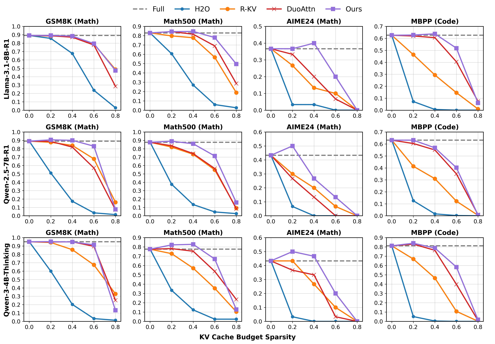

# Which Heads Matter for Reasoning? RL-Guided KV Cache Compression
[[arXiv](https://arxiv.org/abs/2510.08525)] [[page](https://kurt232.github.io/RLKV_Web/)]


# TL;DR
We identify reasoning heads in reasoning LLMs that are critical to maintaining reasoning quality. By allocating full KV cache to these heads and applying compressed constant KV cache to others, our RLKV method achieves memory reduction with near lossless performance.

# Abstract
Reasoning large language models exhibit complex reasoning behaviors through the extended chain-of-thought generation, creating unprecedented Key-Value (KV) cache overhead during the decoding phase. Existing KV cache compression methods underperform on reasoning models: token-dropping methods break reasoning integrity by discarding critical information, while head-reallocating methods mistakenly compress reasoning-critical heads since they are designed for retrieval tasks, resulting in significant performance degradation as compression rates increase. We hypothesize that KV heads exhibit functional heterogeneity in reasoning models-some heads are critical for chain-of-thought consistency while others are compressible. To validate and exploit this insight, we propose RLKV, a novel reasoning-critical head identification framework, which uses reinforcement learning to directly optimize the relationship between each head's cache usage and reasoning quality. As RLKV produces rewards from actual generated samples during training, it naturally identifies heads relevant to reasoning behaviors. We then allocate full KV cache to these heads while applying compressed constant KV cache to others for efficient inference. Our experiments reveal that only a small fraction of attention heads is essential for reasoning, enabling our KV compression approach to outperform baseline methods while achieving **20-50%** cache reduction with near lossless performance compared to uncompressed results.

# Installation and Usage

## Environment Setup

### Training Environment
```bash
conda create -n rlkv python=3.10 -y
conda activate rlkv

conda install -y git
conda install -y -c nvidia/label/cuda-12.8.1 cuda-toolkit
conda install -y nvidia::cuda-cudart-dev

pip install torch==2.8.0 torchvision torchaudio --index-url https://download.pytorch.org/whl/cu128
pip freeze | grep -iE 'torch|nvidia' > /tmp/constraints.txt

# clone
git clone git@github.com:Kurt232/RLKV.git --recurse-submodules
cd RLKV

# sglang
cd sglang
pip install -e "python[srt]" -c /tmp/constraints.txt
cd ..

# areal
cd AReaL # based on v0.3.4.post1
pip uninstall pynvml cugraph-dgl dask-cuda cugraph-service-server raft-dask cugraph cuml cugraph-pyg -y
pip install "deepspeed>=0.17.2" pynvml -c /tmp/constraints.txt
pip install megatron-core==0.13.1 nvidia-ml-py -c /tmp/constraints.txt
pip install "flash-attn<=2.8.1" --no-build-isolation --no-cache-dir

# Package used for calculating math reward
pip install -e evaluation/latex2sympy
# Install AReaL
pip install -e .[dev] -c /tmp/constraints.txt
cd ..

# block streaming attn
git clone https://github.com/mit-han-lab/Block-Sparse-Attention
cd Block-Sparse-Attention
MAX_JOBS=1 python setup.py install
cd ..

# fixup
# pip install openai==1.99.6
pip install partial-json-parser
pip install latex2sympy2
```

### Evaluation Environment
```bash
# ./
conda create -n rlkv-eval python=3.10 -y
conda activate rlkv-eval

conda install -y -c nvidia/label/cuda-12.8.1 cuda-toolkit
conda install -y nvidia::cuda-cudart-dev

pip install torch==2.8.0 torchvision torchaudio --index-url https://download.pytorch.org/whl/cu128
pip install transformers==4.51.3 datasets==4.0.0

pip install ninja packaging
pip install flash-attn==2.8.1  --no-build-isolation
pip install -e .
```

## Model
To download models supported by RLKV:
```bash
hf download deepseek-ai/DeepSeek-R1-Distill-Llama-8B
hf download deepseek-ai/DeepSeek-R1-Distill-Qwen-7B
hf download Qwen/Qwen3-4B-Thinking-2507

mkdir eval/models
ln -s $HF_HOME/hub/models--deepseek-ai--DeepSeek-R1-Distill-Llama-8B/snapshots/6a6f4aa4197940add57724a7707d069478df56b1 eval/models/Llama-3.1-8B-R1
ln -s $HF_HOME/hub/models--deepseek-ai--DeepSeek-R1-Distill-Qwen-7B/snapshots/916b56a44061fd5cd7d6a8fb632557ed4f724f60 eval/models/Qwen-2.5-7B-R1
ln -s $HF_HOME/hub/models--Qwen--Qwen3-4B-Thinking-2507/snapshots/768f209d9ea81521153ed38c47d515654e938aea eval/models/Qwen-3-4B-Thinking
```

## Dataset
We already prepare the training data and evaluation benchmark on our [huggingface](https://huggingface.co/Kurt232), and our code will automatically download them when running training/evaluation scripts.

We also provide instructions to prepare the datasets from scratch. (Coming soon)

# RLKV training
```bash
conda activate rlkv
cd AReaL

# recipes
bash scripts/run_llama-8b-r1.sh
bash scripts/run_qwen-7b-r1.sh
bash scripts/run_qwen3-4b-thinking.sh
```

# Evaluation
```bash
conda activate rlkv-eval

# main results
bash scripts/run_bench_rlkv.sh
bash scripts/run_bench_base.sh
```

# Results

## main results
