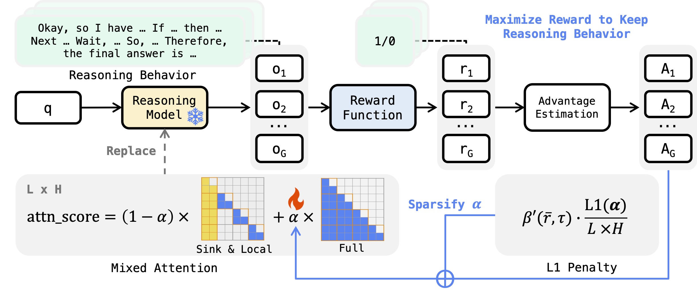
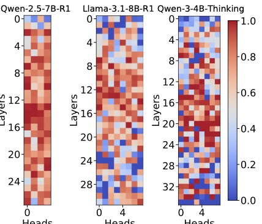
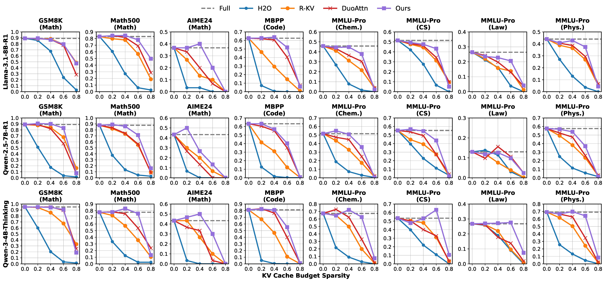

# Which Heads Matter for Reasoning? RL-Guided KV Cache Compression
[[arXiv](https://arxiv.org/abs/2510.08525)] [[page](https://kurt232.github.io/RLKV)]


# News
- **2026/04**: RLKV is supported in [SGLang inference](#sglang-inference).
- **2026/03**: RLKV is presented at the [LIT @ ICLR 2026 workshop](https://latent-implicit-thinking.github.io/).
- **2025/10**: arXiv preprint is released.

# TL;DR
We use reinforcement learning as a probe to discover which attention heads contribute to reasoning quality, then allocate full KV cache to reasoning-critical heads while aggressively compressing others. RLKV achieves **20-50%** cache reduction with near-lossless performance.

# Abstract
Reasoning large language models exhibit complex reasoning behaviors via extended chain-of-thought generation that are highly fragile to information loss during decoding, creating critical challenges for KV cache compression. Existing token-dropping methods directly disrupt reasoning chains by removing intermediate steps, while head-reallocation methods, designed for retrieval tasks, fail to preserve the heads essential for generative reasoning. However, no existing method can identify which attention heads genuinely maintain reasoning consistency and control generation termination. To address this, we propose RLKV, which uses reinforcement learning as a probe to discover which heads contribute to reasoning quality by directly optimizing their cache usage against actual generation outcomes. This discovery naturally leads to an efficient compression strategy: we allocate full KV cache to reasoning-critical heads while aggressively compressing others with constant-size KV cache. Experiments reveal that a fraction of heads proves essential for reasoning, enabling **20-50%** cache reduction with near-lossless performance across diverse tasks and models.

# Method

RLKV identifies reasoning-critical attention heads through three components:

- **Mixed attention with gating adapters.** A learnable gating parameter $\alpha_{l,h} \in [0,1]$ is attached to each KV head, mixing full attention with local (streaming) attention: $\text{out} = \alpha \cdot \text{out}_{\text{full}} + (1-\alpha) \cdot \text{out}_{\text{local}}$. All LLM parameters are frozen, so only the $L \times H$ gating adapters are optimized.
- **RL with verifiable reward.** Adapters are trained with GRPO (without KL penalty) on mathematical reasoning problems, with an L1 penalty on $\alpha$ for sparsity. The reward signal pushes $\alpha \to 1$ for reasoning-critical heads while L1 drives compressible heads to $0$.
- **Stabilization.** To prevent the collapse caused by sparse rewards clashing with dense L1 penalty as sparsity rises, RLKV combines *self-distillation sampling* (curriculum of solvable problems drawn from the model's own correct rollouts) and *adaptive penalty weighting* $\beta'(\bar r, \tau) = \mathbb{I}(\bar r > \tau)\cdot\beta\cdot(\exp(\bar r)-1)$ (exponential scaling + hard cutoff).

At inference, KV heads are ranked by learned $\alpha$; the top-k receive full KV cache, while the rest use full attention over a compressed KV cache retaining only sink + recent tokens.



*Gating score distribution after RLKV training on three GQA models. Qwen-2.5-7B-R1 exhibits inherent limitations on achievable sparsification without compromising reasoning, due to its larger KV group size of 7 (vs. 4 in the other two models).*

# Installation and Usage

## Environment Setup

### Training Environment
```bash
conda create -n rlkv python=3.10 -y
conda activate rlkv

conda install -y git
conda install -y -c nvidia/label/cuda-12.8.1 cuda-toolkit
conda install -y nvidia::cuda-cudart-dev

pip install torch==2.8.0 torchvision torchaudio --index-url https://download.pytorch.org/whl/cu128
pip freeze | grep -iE 'torch|nvidia' > /tmp/constraints.txt

# clone
git clone git@github.com:Kurt232/RLKV.git --recurse-submodules
cd RLKV

# sglang
cd sglang
pip install -e "python[srt]" -c /tmp/constraints.txt
cd ..

# areal
cd AReaL # based on v0.3.4.post1
pip uninstall pynvml cugraph-dgl dask-cuda cugraph-service-server raft-dask cugraph cuml cugraph-pyg -y
pip install "deepspeed>=0.17.2" pynvml -c /tmp/constraints.txt
pip install megatron-core==0.13.1 nvidia-ml-py -c /tmp/constraints.txt
pip install "flash-attn<=2.8.1" --no-build-isolation --no-cache-dir

# Package used for calculating math reward
pip install -e evaluation/latex2sympy
# Install AReaL
pip install -e .[dev] -c /tmp/constraints.txt
cd ..

# block streaming attn
git clone https://github.com/mit-han-lab/Block-Sparse-Attention
cd Block-Sparse-Attention
MAX_JOBS=1 python setup.py install
cd ..

# fixup
# pip install openai==1.99.6
pip install partial-json-parser
pip install latex2sympy2
```

### Evaluation Environment
```bash
# ./
conda create -n rlkv-eval python=3.10 -y
conda activate rlkv-eval

conda install -y -c nvidia/label/cuda-12.8.1 cuda-toolkit
conda install -y nvidia::cuda-cudart-dev

pip install torch==2.8.0 torchvision torchaudio --index-url https://download.pytorch.org/whl/cu128
pip freeze | grep -iE 'torch|nvidia' > /tmp/constraints.txt

pip install transformers==4.51.3 datasets==4.0.0

pip install ninja packaging
pip install flash-attn==2.8.1  --no-build-isolation

# sglang (for RLKV inference)
cd sglang
pip install -e "python[srt]" -c /tmp/constraints.txt
cd ..

pip install -e .
```

## Model
To download models supported by RLKV:
```bash
hf download deepseek-ai/DeepSeek-R1-Distill-Llama-8B
hf download deepseek-ai/DeepSeek-R1-Distill-Qwen-7B
hf download Qwen/Qwen3-4B-Thinking-2507

mkdir eval/models
ln -s $HF_HOME/hub/models--deepseek-ai--DeepSeek-R1-Distill-Llama-8B/snapshots/6a6f4aa4197940add57724a7707d069478df56b1 eval/models/Llama-3.1-8B-R1
ln -s $HF_HOME/hub/models--deepseek-ai--DeepSeek-R1-Distill-Qwen-7B/snapshots/916b56a44061fd5cd7d6a8fb632557ed4f724f60 eval/models/Qwen-2.5-7B-R1
ln -s $HF_HOME/hub/models--Qwen--Qwen3-4B-Thinking-2507/snapshots/768f209d9ea81521153ed38c47d515654e938aea eval/models/Qwen-3-4B-Thinking
```

## Dataset
We already prepare the training data and evaluation benchmark on our [huggingface](https://huggingface.co/Kurt232), and our code will automatically download them when running training/evaluation scripts.

We also provide instructions to prepare the datasets from scratch. (Coming soon)

# RLKV training

Training uses 3,000 mathematical problems filtered from [DeepScaleR](https://huggingface.co/datasets/agentica-org/DeepScaleR-Preview-Dataset) via self-distillation sampling, optimized with GRPO (4 samples per query) and AdamW (lr $0.01$) for 185 steps on 2×A100 (80GB). During training, local attention uses 128 sink tokens + 256 local tokens; at evaluation, the compressed KV cache uses 16 sink tokens + 64 local tokens.

```bash
conda activate rlkv
cd AReaL

# recipes
bash scripts/run_llama-8b-r1.sh
bash scripts/run_qwen-7b-r1.sh
bash scripts/run_qwen3-4b-thinking.sh
```

# Evaluation
```bash
conda activate rlkv-eval

# main results
bash scripts/run_bench_rlkv.sh
bash scripts/run_bench_base.sh
```

# Results

## Main Results
RLKV is evaluated on three reasoning models across four reasoning benchmarks (GSM8K, Math500, AIME24, MBPP) and four knowledge benchmarks (MMLU-Pro: Chemistry, Computer Science, Law, Physics), compared against H2O, R-KV (token-dropping), and DuoAttention (head-reallocation).



### Near-Lossless Performance
RLKV achieves 20-50% KV cache reduction with near-lossless performance, while baselines suffer notable drops at the same sparsity thresholds:

| Model | GSM8K | Math500 | AIME24 | MBPP |
|---|---|---|---|---|
| **Llama-3.1-8B-R1** | sparsity 0.4 | sparsity 0.5 | sparsity 0.4 | sparsity 0.4 |
| Full (baseline) | 89.2 | 83.0 | 36.7 | 62.6 |
| RLKV (Ours) | 86.8 (-2.3) | **85.0 (+2.0)** | **40.0 (+3.3)** | **63.8 (+1.2)** |
| **Qwen-2.5-7B-R1** | sparsity 0.4 | sparsity 0.4 | sparsity 0.2 | sparsity 0.3 |
| Full (baseline) | 89.1 | 87.8 | 43.3 | 63.2 |
| RLKV (Ours) | **90.1 (+1.0)** | 86.0 (-1.8) | **50.0 (+6.7)** | 62.0 (-1.2) |
| **Qwen-3-4B-Thinking** | sparsity 0.5 | sparsity 0.5 | sparsity 0.5 | sparsity 0.5 |
| Full (baseline) | 95.1 | 77.6 | 43.3 | 81.2 |
| RLKV (Ours) | 94.4 (-0.7) | 77.0 (-0.6) | **43.3 (+0.0)** | 78.0 (-3.2) |

### Long-Context Generalization (LongReason-64K)
RLKV is trained only on math problems that fit in 8K tokens, yet generalizes to long-context reasoning. We evaluate on [LongReason](https://arxiv.org/abs/2501.15089)'s 64K-input subset (400 samples, 70K model context) with Llama-3.1-8B-R1 against R-KV, DuoAttention, and the recent head-reallocation baseline [KVZip](https://arxiv.org/abs/2505.23416). H2O runs out of memory in this setting.

| Method         | Full   | sp=0.2 | sp=0.4 | sp=0.6    | sp=0.8    |
|----------------|--------|--------|--------|-----------|-----------|
| R-KV           | 49.25  | 0.0    | 0.0    | 0.0       | 0.0       |
| DuoAttention   | —      | 49.5   | 48.75  | 35.25     | 1.5       |
| KVZip          | —      | 48.0   | 49.0   | 36.0      | 4.75      |
| **RLKV (Ours)**| —      | **50.5** | **52.5** | **45.25** | **15.0** |

RLKV substantially outperforms all baselines, with the gap widening at high sparsity. Token-dropping (R-KV) collapses entirely — every output degenerates into a repetitive loop. Head-reallocation baselines preserve reasoning ability but degrade more steeply than RLKV since their head identification relies on proxies that do not directly capture reasoning behavior. The fact that 8K-trained adapters transfer to 70K contexts shows RLKV captures reasoning behavior itself, which transfers across context lengths.

### End-to-End Speedup
On Math500 with Llama-3.1-8B-R1 at sparsity 0.5, RLKV achieves **1.09-1.21x** end-to-end speedup by reducing KV cache memory and enabling larger batch sizes (vanilla PyTorch/Transformers + FlashAttention-2):

| Full Batch → RLKV Batch | GPU Memory | Speedup | Accuracy |
|---|---|---|---|
| 2 → 4 | ~19 GB | **1.16x** | 0.792 |
| 4 → 8 | ~24 GB | **1.16x** | 0.792 |
| 8 → 16 | ~32 GB | **1.21x** | 0.768 |
| 16 → 32 | ~50 GB | **1.09x** | 0.764 |

## SGLang Inference

We provide native SGLang inference support for RLKV via a custom `HeadReallocAttnBackend`. **This support lives in our [RLKV fork of SGLang](./sglang) (the `sglang` submodule in this repo, based on v0.5.2)** — not upstream SGLang — and is installed automatically when you clone with `--recurse-submodules` and run the install steps above. It implements head reallocation with a **dual KV pool**: reasoning-critical heads use the full pool, while compressible heads share a small pool that retains only sink + recent tokens (evicted on the fly during extend/decode). Memory saved on the compressed side is rebalanced into the full pool, so the total token budget grows rather than shrinks. CUDA graphs, continuous batching, and compressed-prefix attention during extend are all supported.

Use `eval/efficiency/pred.py` for efficiency-oriented batch inference:

```bash
# Single run: RLKV at sparsity 0.5
python eval/efficiency/pred.py \
    --model Llama-3.1-8B-R1 \
    --task math_500 \
    --method rlkv \
    --sparsity 0.5 \
    --adapter-load-path head_dist/rlkv/Llama-3.1-8B-R1/llama_lr1e-2_ep2_bs32_reg1e-3_tau0.5 \
    --max-running-requests 300

# Full sweep: full baseline + sparsities {0.2, 0.4, 0.5, 0.6, 0.8} in parallel
bash scripts/run_efficiency.sh 4 5 6 7
```

**End-to-end results on MATH-500** (Llama-3.1-8B-R1, single A100 40G, SGLang v0.5.2). Theoretical speedup is computed as $1/((1-s) + s \cdot W/L)$ with compressed window $W = 80$ (16 sink + 64 local) and average sequence length $L \approx 3000$ under continuous batching:

| Sparsity   | Accuracy | Theoretical | Time (s) | E2E Speedup  | Throughput (tok/s) | Thpt Speedup  |
|------------|----------|-------------|----------|--------------|--------------------|---------------|
| 0% (Full)  | 79.4     | —           | 1036     | 1.00x        | 1500               | 1.00x         |
| 20%        | 78.6     | 1.24x       | 874      | **1.19x**    | 1758               | **1.17x**     |
| 40%        | 79.6     | 1.64x       | 666      | **1.56x**    | 2185               | **1.46x**     |
| 50%        | 77.6     | 1.95x       | 574      | **1.80x**    | 2553               | **1.70x**     |
| 60%        | 73.8     | 2.40x       | 504      | **2.06x**    | 2941               | **1.96x**     |

The SGLang backend achieves **near-theoretical** speedup at practical sparsity levels. The remaining gap is due to dual-dispatch attention overhead; customized fused kernels for heterogeneous-head attention can close it further.

# Citation
```bibtex
@article{du2025whichheads,
  title={Which Heads Matter for Reasoning? RL-Guided KV Cache Compression},
  author={Du, Wenjie and Jiang, Li and Tao, Keda and Liu, Xue and Wang, Huan},
  journal={arXiv preprint arXiv:2510.08525},
  year={2025}
}
```